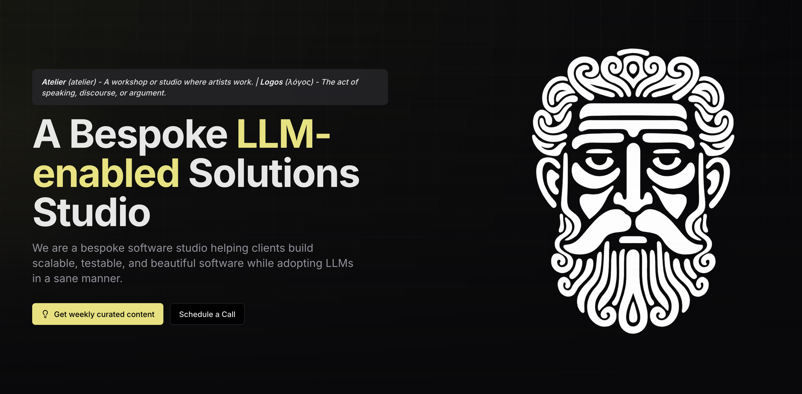

# Atelier Logos Studio

> *Atelier (ατελιέ) - A workshop or studio where artists work. | Logos (Λόγος) - The act of speaking, discourse, or argument.*

**A Bespoke LLM-enabled Solutions Studio**

We are a bespoke software studio helping clients build scalable, testable, and beautiful software while adopting LLMs in a sane manner.

## 🚀 Features

- **Modern Tech Stack**: Built with Next.js 15, React 19, and TypeScript
- **Beautiful UI**: Powered by Radix UI and Tailwind CSS
- **Authentication**: Secure user authentication with Supabase
- **Real-time Features**: Pusher integration for live updates
- **Payment Processing**: Stripe integration for seamless transactions
- **Blog System**: Built-in blog with markdown support
- **User Profiles**: Complete user management system
- **Responsive Design**: Mobile-first approach with modern design principles
- **PWA Ready**: Progressive Web App capabilities with service worker

## 🛠️ Tech Stack

### Core
- **Framework**: Next.js 15 (App Router)
- **Language**: TypeScript
- **Styling**: Tailwind CSS + Stylus modules
- **UI Components**: Radix UI + Shadcn/ui
- **State Management**: Zustand
- **Package Manager**: Bun

### Backend & Services
- **Database**: Supabase
- **Authentication**: Supabase Auth
- **Payments**: Stripe
- **Real-time**: Pusher
- **Push Notifications**: Pusher Push Notifications

### Development Tools
- **Linting**: ESLint
- **Formatting**: Standard.js rules
- **Icons**: Lucide React + Radix Icons

## 🏃‍♂️ Getting Started

### Prerequisites
- Node.js 18+ or Bun
- Git

### Installation

1. **Clone the repository**
   ```bash
   git clone https://github.com/your-username/www.atelierlogos.studio.git
   cd www.atelierlogos.studio
   ```

2. **Install dependencies**
   ```bash
   bun install
   # or
   npm install
   ```

3. **Set up environment variables**
   ```bash
   cp .env.example .env.local
   ```
   Fill in your environment variables for Supabase, Stripe, Pusher, etc.

4. **Run the development server**
   ```bash
   bun dev
   # or
   npm run dev
   ```

5. **Open your browser**
   Navigate to [http://localhost:3000](http://localhost:3000)

## 📁 Project Structure

```
├── app/                    # Next.js App Router
│   ├── api/               # API routes
│   ├── auth/              # Authentication pages
│   ├── blog/              # Blog system
│   ├── onboarding/        # User onboarding
│   ├── profile/           # User profiles
│   └── support/           # Support pages
├── components/            # Reusable UI components
├── hooks/                 # Custom React hooks
├── lib/                   # Utility functions and configurations
├── public/                # Static assets
├── scripts/               # Build and deployment scripts
└── styles/                # Global styles and Stylus modules
```

## 🎨 Design System

Our design system follows these principles:
- **Consistent**: Using a unified color palette and typography
- **Accessible**: WCAG compliant components
- **Responsive**: Mobile-first design approach
- **Modern**: Clean, minimalist aesthetic with thoughtful animations

## 🚀 Deployment

### Vercel (Recommended)
1. Connect your repository to Vercel
2. Set up environment variables
3. Deploy automatically on push to main

### Manual Deployment
```bash
bun run build
bun run start
```

## 🤝 Contributing

We welcome contributions! Please see our [Contributing Guidelines](CONTRIBUTING.md) for details.

### Development Workflow
1. Fork the repository
2. Create a feature branch (`git checkout -b feature/amazing-feature`)
3. Make your changes following our coding standards
4. Commit your changes (`git commit -m 'Add amazing feature'`)
5. Push to the branch (`git push origin feature/amazing-feature`)
6. Open a Pull Request

## 📋 Scripts

- `bun dev` - Start development server
- `bun build` - Build for production
- `bun start` - Start production server
- `bun lint` - Run ESLint

## 🔧 Environment Variables

Create a `.env.local` file with the following variables:

```env
# Supabase
NEXT_PUBLIC_SUPABASE_URL=your_supabase_url
NEXT_PUBLIC_SUPABASE_ANON_KEY=your_supabase_anon_key
SUPABASE_SERVICE_ROLE_KEY=your_service_role_key

# Stripe
STRIPE_SECRET_KEY=your_stripe_secret_key
NEXT_PUBLIC_STRIPE_PUBLISHABLE_KEY=your_stripe_publishable_key

# Pusher
PUSHER_APP_ID=your_pusher_app_id
PUSHER_KEY=your_pusher_key
PUSHER_SECRET=your_pusher_secret
PUSHER_CLUSTER=your_pusher_cluster
```

## 📞 Support

- 📧 Support: [Create an account](https://www.www.atelierlogos.studio/onboarding) and chat with us
- 💬 Schedule a Call: Available on the homepage

---

**Built with ❤️ in Knoxville, TN**